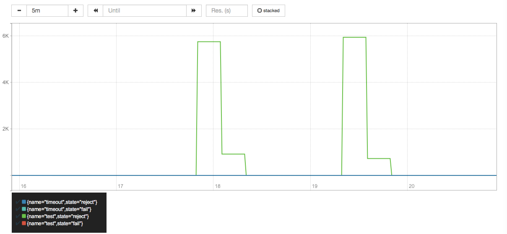
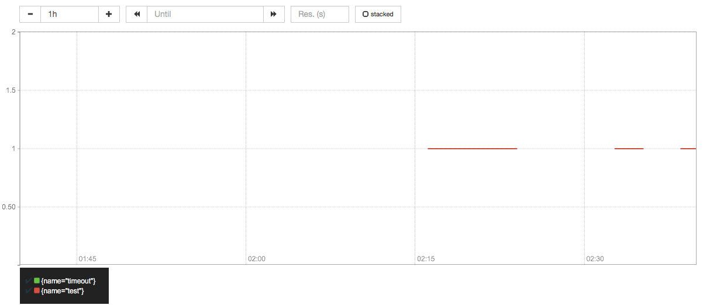

# gobreak
[](https://travis-ci.org/hnlq715/gobreak)
[](https://goreportcard.com/report/github.com/hnlq715/gobreak)
[](https://codecov.io/gh/hnlq715/gobreak)

Latency and fault tolerance library like Netflix's Hystrix with prometheus and gobreaker.

Feature
---

* Lightweight
* Easy to use
* Panic recoverable
* Prometheus metric supported
* Integrated with context.Context
* Async and sync method supported
* Unit test coverage almost 100%

Install
---
```
go get -u -v github.com/hnlq715/gobreak
```
Try example
---
```
package main

import (
	"context"
	"errors"
	"net/http"
	"os"
	"time"

	"github.com/hnlq715/gobreak"
	"github.com/prometheus/client_golang/prometheus"
)

func main() {

	http.HandleFunc("/test", func(rw http.ResponseWriter, r *http.Request) {
		err := gobreak.Do(r.Context(), "test", func(context.Context) error {
			return errors.New("mock error\n")
		}, func(context.Context, error) error {
			return errors.New("fallback\n")
		})
		rw.Write([]byte(err.Error()))
	})

	http.HandleFunc("/timeout", func(rw http.ResponseWriter, r *http.Request) {
		err := gobreak.Do(r.Context(), "timeout", func(context.Context) error {
			time.Sleep(2 * time.Second)
			return errors.New("mock error\n")
		}, nil)
		rw.Write([]byte(err.Error()))
	})

	prometheus.Unregister(prometheus.NewGoCollector())
	prometheus.Unregister(prometheus.NewProcessCollector(os.Getpid(), ""))
	http.Handle("/metrics", prometheus.Handler())
	http.ListenAndServe("0.0.0.0:8000", nil)
}
```

```
go install github.com/hnlq715/gobreak/example
$(GOPATH)/bin/example
```

* Fail and fallback
```
➜  gobreak git:(master) ✗ curl localhost:8000
fallback
➜  gobreak git:(master) ✗ curl localhost:8000
fallback
➜  gobreak git:(master) ✗ curl localhost:8000
fallback
➜  gobreak git:(master) ✗ curl localhost:8000
fallback
```

* Timeout and fast fail
```
➜  gobreak git:(master) ✗ time curl localhost:8000/timeout
mock error
curl localhost:8000/timeout  0.01s user 0.01s system 0% cpu 2.026 total
➜  gobreak git:(master) ✗ time curl localhost:8000/timeout
mock error
curl localhost:8000/timeout  0.01s user 0.01s system 0% cpu 2.019 total
➜  gobreak git:(master) ✗ time curl localhost:8000/timeout
mock error
curl localhost:8000/timeout  0.01s user 0.01s system 0% cpu 2.021 total
➜  gobreak git:(master) ✗ time curl localhost:8000/timeout
mock error
curl localhost:8000/timeout  0.01s user 0.01s system 0% cpu 2.021 total
➜  gobreak git:(master) ✗ time curl localhost:8000/timeout
mock error
curl localhost:8000/timeout  0.01s user 0.01s system 0% cpu 2.018 total
➜  gobreak git:(master) ✗ time curl localhost:8000/timeout
mock error
curl localhost:8000/timeout  0.01s user 0.01s system 0% cpu 2.023 total
➜  gobreak git:(master) ✗ time curl localhost:8000/timeout
circuit breaker 'timeout' is open
curl localhost:8000/timeout  0.01s user 0.01s system 68% cpu 0.019 total
```

Prometheus metrics
---
```
# HELP gobreak_request_latency_histogram request latency histogram.
# TYPE gobreak_request_latency_histogram histogram
gobreak_request_latency_histogram_bucket{name="test",le="0.005"} 4
gobreak_request_latency_histogram_bucket{name="test",le="0.01"} 4
gobreak_request_latency_histogram_bucket{name="test",le="0.025"} 4
gobreak_request_latency_histogram_bucket{name="test",le="0.05"} 4
gobreak_request_latency_histogram_bucket{name="test",le="0.1"} 4
gobreak_request_latency_histogram_bucket{name="test",le="0.25"} 4
gobreak_request_latency_histogram_bucket{name="test",le="0.5"} 4
gobreak_request_latency_histogram_bucket{name="test",le="1"} 4
gobreak_request_latency_histogram_bucket{name="test",le="2.5"} 4
gobreak_request_latency_histogram_bucket{name="test",le="5"} 4
gobreak_request_latency_histogram_bucket{name="test",le="10"} 4
gobreak_request_latency_histogram_bucket{name="test",le="+Inf"} 4
gobreak_request_latency_histogram_sum{name="test"} 1.1410000000000002e-06
gobreak_request_latency_histogram_count{name="test"} 4
gobreak_request_latency_histogram_bucket{name="timeout",le="0.005"} 0
gobreak_request_latency_histogram_bucket{name="timeout",le="0.01"} 0
gobreak_request_latency_histogram_bucket{name="timeout",le="0.025"} 0
gobreak_request_latency_histogram_bucket{name="timeout",le="0.05"} 0
gobreak_request_latency_histogram_bucket{name="timeout",le="0.1"} 0
gobreak_request_latency_histogram_bucket{name="timeout",le="0.25"} 0
gobreak_request_latency_histogram_bucket{name="timeout",le="0.5"} 0
gobreak_request_latency_histogram_bucket{name="timeout",le="1"} 0
gobreak_request_latency_histogram_bucket{name="timeout",le="2.5"} 6
gobreak_request_latency_histogram_bucket{name="timeout",le="5"} 6
gobreak_request_latency_histogram_bucket{name="timeout",le="10"} 6
gobreak_request_latency_histogram_bucket{name="timeout",le="+Inf"} 6
gobreak_request_latency_histogram_sum{name="timeout"} 12.018237157000002
gobreak_request_latency_histogram_count{name="timeout"} 6
# HELP gobreak_requests request count.
# TYPE gobreak_requests counter
gobreak_requests{name="test",state="fail"} 4
gobreak_requests{name="timeout",state="fail"} 6
gobreak_requests{name="timeout",state="reject"} 4
# HELP http_request_duration_microseconds The HTTP request latencies in microseconds.
# TYPE http_request_duration_microseconds summary
http_request_duration_microseconds{handler="prometheus",quantile="0.5"} NaN
http_request_duration_microseconds{handler="prometheus",quantile="0.9"} NaN
http_request_duration_microseconds{handler="prometheus",quantile="0.99"} NaN
http_request_duration_microseconds_sum{handler="prometheus"} 0
http_request_duration_microseconds_count{handler="prometheus"} 0
# HELP http_request_size_bytes The HTTP request sizes in bytes.
# TYPE http_request_size_bytes summary
http_request_size_bytes{handler="prometheus",quantile="0.5"} NaN
http_request_size_bytes{handler="prometheus",quantile="0.9"} NaN
http_request_size_bytes{handler="prometheus",quantile="0.99"} NaN
http_request_size_bytes_sum{handler="prometheus"} 0
http_request_size_bytes_count{handler="prometheus"} 0
# HELP http_response_size_bytes The HTTP response sizes in bytes.
# TYPE http_response_size_bytes summary
http_response_size_bytes{handler="prometheus",quantile="0.5"} NaN
http_response_size_bytes{handler="prometheus",quantile="0.9"} NaN
http_response_size_bytes{handler="prometheus",quantile="0.99"} NaN
http_response_size_bytes_sum{handler="prometheus"} 0
http_response_size_bytes_count{handler="prometheus"} 0
```

Prometheus Graph (like Netflix-dashboard)
---

Also you can use `Grafana` instead to graph and alert, which is recommended.

* metric: gobreak_requests
```
sum by(name, state) (irate(gobreak_requests[5m]))
```



* metric: gobreak_request_latency_histogram [Apdex score](https://en.wikipedia.org/wiki/Apdex)

```
(sum(rate(gobreak_request_latency_histogram_bucket{le="0.05"}[5m])) by (name) + (sum(rate(gobreak_request_latency_histogram_bucket{le="0.1"}[5m])) by (name))) / 2/ sum(rate(gobreak_request_latency_histogram_count[5m])) by (name)
```


